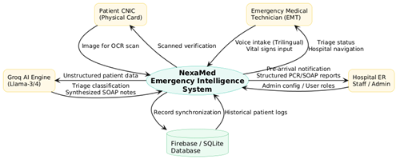

# NexaMed: AI-Based Emergency Triage System

NexaMed is an intelligent healthcare solution designed to optimize the "Golden Hour" in emergency medical services. By leveraging Large Language Models (LLM) and real-time data, the system automates patient prioritization and hospital routing.

## 🚀 Key Features
- **Trilingual NLP Intake:** Processes emergency data in English, Urdu, and Roman Urdu.
- **AI-Powered Triage:** Uses Groq (Llama-3) to map symptoms against the Emergency Severity Index (ESI).
- **Dynamic Resource Matching:** Real-time hospital availability and proximity logic via Firebase and Leaflet.js.
- **Automated Handover:** Generates standardized SOAP notes and PDF reports for ER readiness.

## 🏗️ System Architecture
Below is the Arechitecture of the NexaMed ecosystem:



## 🛠️ Tech Stack
- **Backend:** Python, FastAPI
- **AI/ML:** Groq Cloud (Llama-3), NLP Entity Extraction
- **Database:** Firebase Realtime Database
- **Frontend:** React, Vite, Tailwind CSS, HTML CSS Web Page
- **Maps:** Leaflet.js, Mapbox API

## 📋 Prerequisites
- Python 3.9+
- Node.js (for frontend)
- API Keys for Groq and Mapbox,Goole Maps

## ⚙️ Installation & Setup
1. **Clone the repository:**
   ```bash
   git clone [https://github.com/Minion248/NexaMed.git](https://github.com/Minion248/NexaMed.git)
   cd NexaMed
2. **Setup Environment Variables:**
Create a .env file based on the .env.example provided and add your API keys.

3. **Install Dependencies:**
pip install -r requirements.txt
cd frontend && npm install
4. **Run the Application:**
# Backend
uvicorn main:app --reload
# Frontend
cd frontend
npm run dev

# Backend
uvicorn main:app --reload
# Frontend
npm run dev


**Team**
Sara Akmal 

Hafsa Rehman

Rayyan Ahsan
